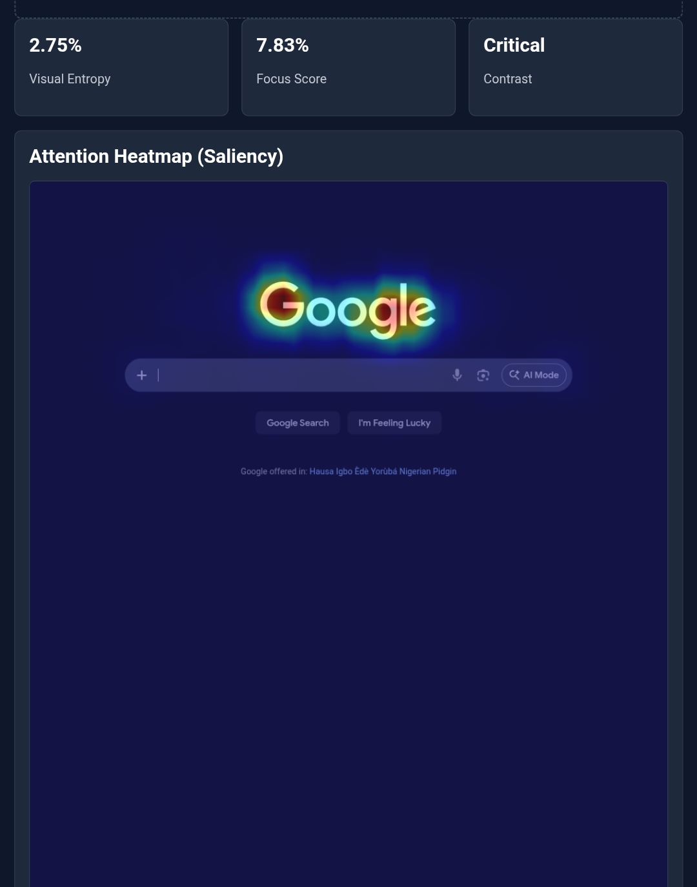
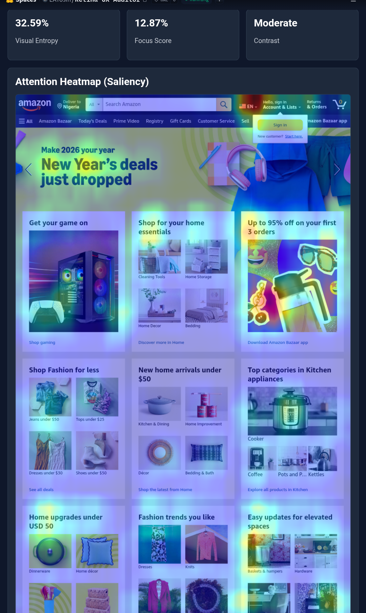
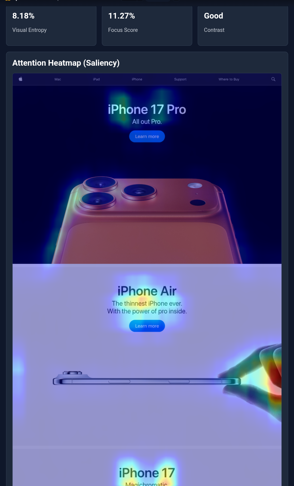

<div align="center">

# 👁️ Retina
### *The Visual Physics Engine for UX Audits*

[](https://python.org)
[](https://opencv.org/)
[](https://ai.google.dev/)
[](https://fastht.ml/)
[](LICENSE)

<!-- Replace with your actual Hero Image/GIF -->
<a href="https://huggingface.co/spaces/EATosin/Retina-UX-Auditor">
  
</a>

<br/>

[Live Demo](https://huggingface.co/spaces/EATosin/Retina-UX-Auditor) • [Architecture](docs/architecture.md) • [Physics Methodology](docs/methodology.md) • [Contributing](CONTRIBUTING.md)

</div>

---

## ⚡ The Problem: "Subjective Design"
Design audits are notoriously subjective. A designer might say a layout "feels cluttered," but an engineer needs to know **how cluttered** and **why**.
Without objective metrics, UI optimization becomes a guessing game.

## 🧠 The Solution: Computational Aesthetics
**Retina** is a **Physics Engine for Interfaces**. It treats a UI screenshot not as art, but as a signal. By applying computer vision algorithms and generative reasoning, it quantifies the quality of user experience.

### The Tri-Core Engine
1.  **Visual Entropy (Clutter):** Uses **Shannon Entropy** principles and Canny Edge Detection to calculate the "Noise Density" of the interface.
2.  **Saliency Heatmaps:** Implements the **Spectral Residual** algorithm (Hou & Zhang) to simulate the biological human visual cortex and predict eye-tracking.
3.  **AI Critic:** Feeds these raw physics metrics into **Gemini 3.0 Vision** to generate an objective, data-backed audit report with CSS fixes.

---

## 🏗️ System Architecture

Retina follows a **Hybrid Inference Architecture**, separating deterministic physics from probabilistic AI.

```mermaid
graph TD
    User[Frontend User] -->|Upload UI Screenshot| Web[FastHTML Server]
    
    subgraph Physics Engine (OpenCV)
    Web -->|Raw Bytes| Preproc[Image Preprocessing]
    Preproc -->|Grayscale| Entropy[Entropy Engine]
    Preproc -->|Spectral Residual| Saliency[Saliency Engine]
    Preproc -->|Pixel Stats| Contrast[Contrast Engine]
    end
    
    subgraph Intelligence Layer (Gemini 2.5/3.0)
    Entropy -->|Clutter Score| Critic[Design Critic]
    Saliency -->|Heatmap| Critic
    Contrast -->|WCAG Verdict| Critic
    Preproc -->|Original Image| Critic
    end
    
    Critic -->|Audit Report| Web
    Saliency -->|Visual Overlay| Web
    Web -->|HTML/HTMX| User
```

> 📖 **Deep Dive:** Read the full [System Architecture Document](docs/architecture.md).

---

## 🖼️ Benchmark Gallery

Retina has been validated against industry-standard interfaces.

| Website | Visual Entropy | Focus Score | Saliency Map |
| :--- | :--- | :--- | :--- |
| **Google** | **Low (5%)** | **High (92%)** |  |
| **Amazon** | **High (45%)** | **Low (30%)** |  |
| **Apple** | **Balanced (15%)** | **High (88%)** |  |

---

## 📚 Knowledge Base
We believe in documenting decisions, not just code.

| Document | Description |
| :--- | :--- |
| **[Methodology](docs/methodology.md)** | The math behind Entropy, RMS Contrast, and Spectral Residuals. |
| **[ADR 001](docs/adr/001-fasthtml-selection.md)** | Architecture Decision Record: Why we chose FastHTML over Streamlit. |
| **[Engineering Log](docs/ENGINEERING_LOG.md)** | Lessons learned during the build process. |

---

## 📦 Installation & Usage

### Prerequisites
*   Python 3.11+
*   Google Gemini API Key

### Local Setup
```bash
# 1. Clone the repository
git clone https://github.com/Eatosin/Retina-UX-Auditor.git
cd Retina-UX-Auditor

# 2. Install dependencies (Headless CV included)
pip install -r requirements.txt

# 3. Configure Environment
# Rename .env.example to .env and add your GEMINI_API_KEY

# 4. Run the Engine
python run.py
```

### Docker Deployment
Retina is container-ready with specific Linux libraries for OpenCV.
```bash
docker build -t retina .
docker run -p 7860:7860 --env-file .env retina
```

---

## 🤝 Contributing

We welcome engineers, physicists, and designers. Retina is an evolving standard.

### 🗺️ The Roadmap (Help Wanted)
*   [ ] **Video Analysis:** Adapting the Saliency Engine for MP4 files (Frame-by-Frame).
*   **Accessibility:** Adding automated ARIA label checking.
*   **Performance:** Porting the OpenCV logic to ONNX for faster inference.

Please read [CONTRIBUTING.md](CONTRIBUTING.md) before submitting a Pull Request.

---

## 👨‍💻 Author
**Owadokun Tosin Tobi**
*Senior AI Engineer & Physicist*

*   **Portfolio:** [GitHub](https://github.com/eatosin)
*   **Connect:** [LinkedIn](https://www.linkedin.com/in/owadokun-tosin-tobi/)

---
