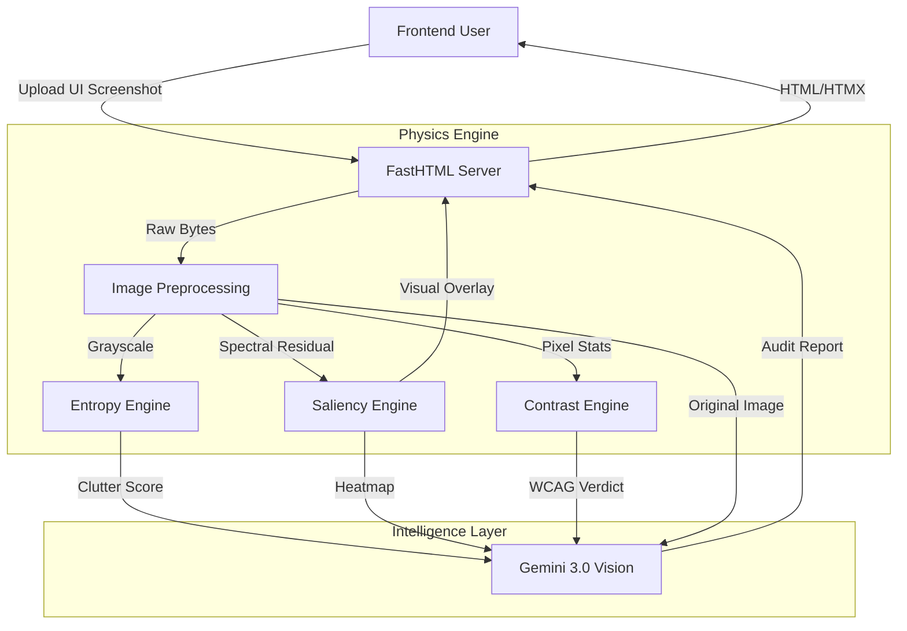

# Retina System Architecture

**Status:** Production
**Version:** 1.0.0
**Author:** Owadokun Tosin Tobi

## 1. High-Level Design
Retina operates as a **Hybrid Inference System**, combining deterministic Computer Vision algorithms (OpenCV) with probabilistic Generative AI (Gemini).



## 2. Core Components

### A. The Physics Layer (Deterministic)
Located in `src/core/physics/`.
*   **Entropy Engine:** Uses Canny Edge Detection to quantify visual noise. High edge density correlates with high cognitive load (Hick's Law).
*   **Saliency Engine:** Implements the **Spectral Residual** algorithm to simulate the "Pop-out" effect of the human visual cortex.
*   **Contrast Engine:** Calculates Root Mean Square (RMS) contrast to determine global accessibility visibility.

### B. The Intelligence Layer (Probabilistic)
Located in `src/core/ai/`.
*   **Design Critic:** A wrapper around **Google Gemini 2.5/3.0**. It acts as the "Reasoning Unit," taking the raw math from the Physics Layer and interpreting it into actionable design advice.

### C. The Presentation Layer
Located in `src/web/`.
*   **FastHTML:** Chosen for its server-side rendering capabilities, allowing for lightweight, low-latency UI updates without a heavy JavaScript bundle.
```

---

